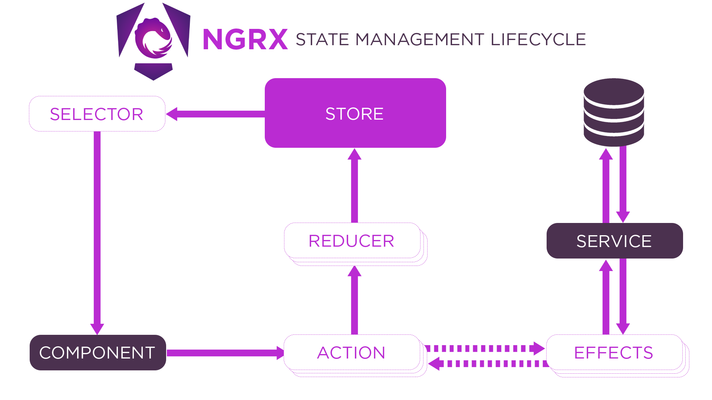

# Angular NgRx Example

This project demonstrates how to use **NgRx**, a state management library for Angular applications. NgRx helps manage application state in a clear, scalable, and predictable way by leveraging the Redux pattern and RxJS.

---

## 📦 What is NgRx?

**NgRx** provides a single source of truth for your application's data using a central **Store**. All changes to this data flow in one direction, making state updates easy to track, debug, and reason about.

NgRx is a state management library for Angular that uses the Redux pattern. It helps you manage application data in a centralized way using Actions, Reducers, Selectors, and Effects. Think of NgRx like a single “data brain” for your app — instead of having different components manage their own data, everything flows through the store, which is a global, reactive data container. When something happens (like clicking a button), you dispatch an Action (e.g., addEmployee). The Reducer takes this action and updates the store immutably. Your components then select the updated data from the store using Selectors. If data needs to be fetched from an API, you use Effects, which listen for specific actions and perform asynchronous work like HTTP calls. For example, if you want to add a new employee, you might dispatch addEmployeeAction({ data }), an Effect catches it and calls an API, and once it succeeds, it dispatches addEmployeeSuccessAction, which the Reducer uses to update the store with the new employee. The UI then automatically reflects this new data — no need to manage complex manual updates. NgRx keeps your logic organized, testable, and scalable, especially in large apps.

---

## 🚩 Key Features and Examples

### 1. Centralized State Management

Manage your app's data in one place: the Store. Any component can read from or update the state.

```angular181html
// Define the shape of your cart state
interface CartState {
    items: Book[];
}

// Initial state
const initialState: CartState = {
    items: []
};
```

---

### 2. Predictable State Updates (Actions and Reducers)

State changes happen via **Actions** and are handled by **Reducers**. Data always flows in a single direction.

```angular181html
// Action: Add a book to the cart
import { createAction, props } from '@ngrx/store';

export const addBook = createAction(
  '[Cart] Add Book',
  props<{ book: Book }>()
);

// Reducer: Handle adding books
import { createReducer, on } from '@ngrx/store';

const cartReducer = createReducer(
  initialState,
  on(addBook, (state, { book }) => ({
  ...state,
  items: [...state.items, book]
  }))
);
```

---

### 3. Handling Side Effects (Effects)

Use **Effects** to handle asynchronous operations, like API calls, outside of your components.

```angular181html
import { createEffect, ofType, Actions } from '@ngrx/effects';
import { switchMap, map } from 'rxjs/operators';

loadBooks$ = createEffect(() =>
  this.actions$.pipe(
    ofType(loadBooks),
    switchMap(() => this.bookService.getBooks()),
    map(books => loadBooksSuccess({ books }))
  )
);
```

---

### 4. Scalability and Maintainability

NgRx enforces a structured approach, making large and growing apps **easier to extend and maintain**.

*Example*: To add new features (like book reviews), introduce new actions, reducers, and selectors—without disturbing unrelated logic.

---

### 5. Debugging with NgRx DevTools

NgRx integrates with DevTools for **time-travel debugging**. See every action and resulting state, move back and forth through state history, and pinpoint issues quickly.

---

### 6. Efficient Data Sharing Between Components

Any component can select data from the store using selectors—no need for prop drilling or repetitive service logic.

```angular181html
this.cart$ = this.store.select(selectCartItems);
```

---

### 7. Performance Optimization

NgRx uses **RxJS and immutable updates**, so only the parts of the UI that need to update will do so, reducing unnecessary re-renders.

---

## 🔄 Typical NgRx Data Flow

1. **Component** dispatches an **Action** (e.g., "Add to cart").
2. **Action** is handled by a **Reducer** (to update state) or an **Effect** (to handle an async task).
3. The **Store** updates the state.
4. Components **select** the necessary state and update their display.

---

## 📚 Learn More

- Official Docs: [NgRx Documentation](https://ngrx.io/docs)
- Example Tutorials: [NgRx Store](https://ngrx.io/guide/store)
- Further Reading: [State Management in Angular Using NgRx Pt 1][6]

---

## 🛠️ Installation

```angular181html
npm install @ngrx/store @ngrx/effects --save

it'll update the `package.json` file and `app.config.ts` which is for 16+ `provideStore()` for below it'll update the `app.module.ts` which is `StoreModule.forRoot()`.
```

---

## 📁 Project Structure Example

```angular181html
src/
app/
core/
state/
cart/
cart.actions.ts
cart.reducer.ts
cart.effects.ts
cart.selectors.ts
```

---

NgRx helps keep your Angular applications *organized*, *scalable*, and *easier to debug*, especially as they grow in complexity.



#### Summary
- **NGRX** it's simply like share the data across the application. with the centralized state management.
- It's store the data in one place called the `store`. 
- Any component can read from or update (means copy the new one it'll never update the data. it'll copy the new updated data) the state by `subscribing` to the `store`.
- State changes happen via `actions` and are handled by `reducers`.
- Data always flows in a single direction.
- Use `effects` to handle asynchronous operations, like API calls, outside of your components. it's send to `actions` to `reducer` and update the store.
- NgRx enforces a structured approach, making large and growing apps easier to extend and maintain.
- NgRx integrates with DevTools for time-travel debugging.
- Any component can select data from the store using selectors.
- NgRx uses RxJS and immutable updates, so only the parts of the UI that need to update will do so, reducing unnecessary re-renders.
- Store has separate logic. if we want we can write the store logic in `Reducers`

-----

- In `NgRx`, `selectors` are pure functions used to extract, transform, and compose slices of state from the NgRx store. They provide a powerful and efficient way to access data within your application's state management.

----
### Let's Start

- I have created the store with the `count.reducer.ts` and in that i initialized the value to `1`.
- I exported the createReducer function from the `@ngrx/store` package. and mentioned the type `number` in the `createReducer` function.
- Firstly, I placed the initial value.
- 
```angular181html
import { createReducer } from '@ngrx/store';

// Define the initial state
const initialState = 10;

// Create the reducer with proper typing
export const counterReducer = createReducer<number>(
    initialState,
);
```
- After that, I placed the `counterReducer` in the `provideStore` in the `app.config.ts` file.

```angular181html
import { ApplicationConfig, provideZoneChangeDetection } from '@angular/core';
import { provideRouter } from '@angular/router';
import { provideStore } from '@ngrx/store';
import {counterReducer} from './store/count.reducer';

export const appConfig: ApplicationConfig = {
    providers: [
        provideRouter([]),
        provideStore({ counterNumber: counterReducer }),
        provideZoneChangeDetection(),
    ],
};
```

- Then, we can access the store in the component.
- I created the `Observable` `counterValue$` to get the value from the store. This is one method to get the data by subscribing to the store.
- I created the `Observable` `counterValueSelector$` to get the value from the store. This is one method to get the data by using `selector` to get the value.
- It will return the `Observable` again, so we need to subscribe to it. so we can directly use the `async pipe` to get the data.

```angular181html
counterValue$: any
counterValueSelector$: any

we need to use constructor to get the value
constructor(private realStore:Store<any>) {
    this.realStore.subscribe(state => {
        this.counterValue = state.counterNumber;
    });
    this.counterValueSelector$ = this.realStore.select('counterNumber');
  }

  <p>Getting count from store observable: {{counterValue$}}</p>
  <p>Getting count from store selector: {{counterValueSelector$ | async}}</p>
```
----

### Discuss about Actions, dispatch actions

#### **Step 1**: Create Actions - Counter

```angular181html
import { createAction } from '@ngrx/store';

export const increment = createAction('[Counter] Increment');
export const decrement = createAction('[Counter] Decrement');
export const reset = createAction('[Counter] Reset');
```
##### What is createAction?

`createAction` is a utility function from NgRx used to define actions in a type-safe and consistent way.

**What is an action?**
- An action is an instruction that tells the store what happened — like:
  - "User clicked increment"
  - "Item was deleted"
  - "API returned success"
- It usually includes:
  - The type of the action
  - Optional payload/data

**Why This Format?**
```angular181html
'[Test for Ngrx] Count Increase'

[Source] Event description

[Source]

- This is a convention that helps identify where the action comes from.
- In this case: [Test for Ngrx] — this might be a component or feature name.
- Makes it easier to debug and log actions.
```

**Event description**

- Describes what happened — e.g., Count Increase, Count Decrease.

| Feature                  | Why It's Useful                                      |
| ------------------------ | ---------------------------------------------------- |
| `[Source] Action` format | Helps in debugging, filtering logs, grouping actions |
| Named action constants   | Avoids typos, provides auto-complete, type safety    |
| `createAction()`         | Gives strongly-typed action creators                 |

---

#### **Step 2**: Create Reducers - Counter

```angular181html
import { createReducer, on } from '@ngrx/store';
import { increment, decrement, reset } from './counter.actions';

const initialState = 0;

export const counterReducer = createReducer(
  initialState,
  on(increment, (state) => state + 1),
  on(decrement, (state) => state - 1),
  on(reset, (state) => 0)
);
```

#### **Step 3**:Use in Component - Counter
```angular181html
import { Store } from '@ngrx/store';
import { increment, decrement, reset } from './counter.actions';

constructor(private store: Store<{ counter: number }>) {}

increment() {
  this.store.dispatch(increment());
}

decrement() {
  this.store.dispatch(decrement());
}

reset() {
  this.store.dispatch(reset());
}
```

### Summary

| Concept             | Description                                                |
| ------------------- | ---------------------------------------------------------- |
| `createAction`      | Used to define a new action                                |
| `[]` in action type | Convention to group actions by feature/module              |
| `Count Increase`    | Description of what the action does                        |
| Benefit             | Clean, readable, and maintainable action structure in NgRx |


### now we can do CRUD with NgRx
- Dashboard
- Employee List / Create / Edit / Delete

**By Store:** We can access the data from the store.
- We can load the data from the store.
- We can update the data in the store.
- We can delete the data in the store.
- We can add the data in the store.

**We need follow some steps:**


- Created the reducer file and placed the initial value. then we need to import in the `app.module.ts` file. Which is `provideStore()` in that `provideStore({ employees: createDataReducer() })`

```angular181html
export const createDataReducer = createReducer(
initialState, // its an array of obj which is employees
);
```

- Later created the action file and placed the actions.
- We need to pass the id in the action.

```angular181html
export const deleteEmployeeAction = createAction('[Employees List] Delete Employee', (id: number) => ({id}));
```

- Later we need to register the action in the reducer.

```angular181html
export const createDataReducer = createReducer(
  initialState,
  on(deleteEmployeeAction, (state, {id}) => {
    return {
      ...state,
      employees: state.employees.filter((emp) => emp.id !== id),
    };
  })
);
```
- Later we need to dispatch the action in the component.

```angular181html
deleteEmployee(id: any) {
  console.log(id);
  // here we can dispatch action
  this.realStore.dispatch({
  type: '[Employees List] DELETE_EMPLOYEE',
  id});
}
```

```angular181html
createEmployee(){
  if (this.employeeForm.invalid) {
    return;
  } else {
    console.log(this.employeeForm.value);
    this.realStore.dispatch({
      type: '[Employees List] CREATE_EMPLOYEE',
      data: this.employeeForm.value
    });
    this.route.navigate(['employees']);
  }
}
```


```angular181html
on(createEmployeeAction, (state, {data}) => {
  console.log(data, state, '.....');
    let obj  = {
    id: 0,
    ...data
  }
  obj.id = state.employees[state.employees.length - 1].id + 1;
  return {
    ...state,
    employees: [...state.employees, obj],
  };
})
```

```angular181html
ngOnInit(): void {
  // Initialize form first
  this.employeeForm = this.fb.group({
    id: ['', Validators.required],
    name: ['', Validators.required],
    salary: ['', Validators.required]
  });
  
  // Get route param and fetch employee
  this.route.params.subscribe(params => {
    this.employeeId = +params['id'];
    
    this.store.select('employeesData').subscribe((val) => {
      const employee = val.employees?.find((emp: any) => emp.id === this.employeeId);
      
      if (employee) {
        this.employeeForm.patchValue(employee);
      } else {
        console.warn(`Employee with id ${this.employeeId} not found.`);
      }
      
      this.employeesData$ = val.employees;
    });
  });
}
```


```angular181html
updateEmployee() {
  if (this.employeeForm.valid) {
    const updatedEmployee = this.employeeForm.value;
    console.log('Updating employee:', updatedEmployee);
    
    // Dispatch update action here if using NgRx
    this.store.dispatch({
    type: '[Employees List] UPDATE_EMPLOYEE',
    data: updatedEmployee});
    // Optionally navigate back
    this.backToList();
  } else {
    this.employeeForm.markAllAsTouched();
  }
}
```

```angular181html
on(updateEmployeeAction, (state, { data }) => {
  const exists = state.employees.some(emp => emp.id === data.id);
  
  return {
    ...state,
    employees: exists ? state.employees.map(emp => emp.id === data.id ? data : emp)
    : [...state.employees, data]
  };
})
```


###### **Any Doubt?** Refer the exact flow:
 - First check store/data.reducer.ts
 - Then check store/data.actions.ts
 - Then check employees-list/employees-list.component.ts
 - What we have done here. Create the dummy data in reducer in initial value. then we need to import in the `app.module.ts` file. Which is `provideStore()` in that `provideStore({ employees: createDataReducer() })`
 - Later we use constructor to get the value from the store in the component of employees list. Then we use the selector to get the value in the template.
 - Then once data is loaded. Then we cretaed the `actions` in that creation of maintaied the `type` and `id` of it because of we are doing `deletion` here.
 - Then we need to pass the id in the action.
 - Then we need to register the action in the reducer.
 - Then we need to dispatch the action in the component. - 
